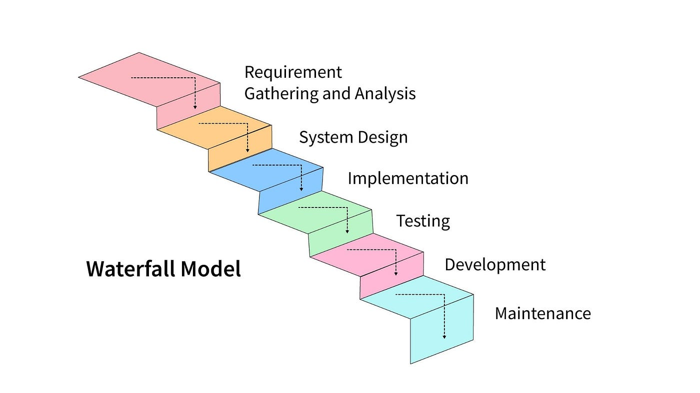
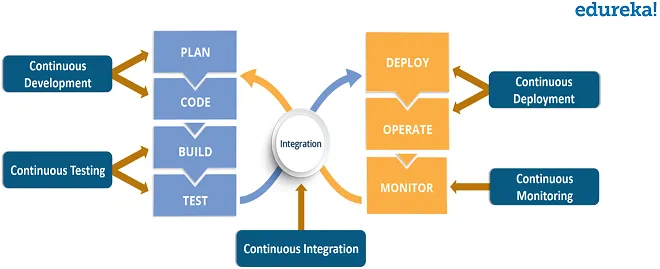

# DevOps, DevSecOps

## Introduction

After completing the development of our microservice, the next step is to make it available to other microservices in a production environment. To achieve this, we need to push the container image to a **Container Registry**, which stores all versions of our container image.

To **build** and **publish** a new version of our container image, we first need to **log in** to the container registry:

```bash
docker login registry.gitlab.com -u myusername --password-stdin
```

Next, we **build** the image with the **latest** tag:

```bash
docker build -t registry.gitlab.com/michelemosca/cloudedgecomputing:latest .
```

Then, we **push** the image to the container registry:

```bash
docker push registry.gitlab.com/michelemosca/cloudedgecomputing --all-tags
```

Once the new version of the container image is uploaded to the registry, other microservices can use it by specifying the image in their **docker-compose** configuration file:

```yml
web:
    image: registry.gitlab.com/michelemosca/cloudedgecomputing:latest
    stop_signal: SIGINT
    environment:
      - SQLALCHEMY_DATABASE_URI=${SQLALCHEMY_DATABASE_URI}
    ports:
      - '80:5000'
    depends_on:
      postgres:
        condition: service_healthy
```

To ensure Docker pulls the latest version of the container image, use the following command:

```bash
docker compose pull
```

Finally, **restart** the microservice to apply the latest image:

```bash
docker compose up -d --build --no-deps web
```

These steps need to be repeated **each time** we develop a new feature for the microservice.

To streamline and automate these tasks, we can adopt **DevOps** practices.


## Brief history of software production models
The software production lifecycle consists of three essential stages, each playing a critical role in delivering a high-quality product that meets client expectations and performs reliably in a live environment:

1. **Requirements Gathering**
    - Collaborate with the client to understand their needs, goals, and expectations.
    - Define the scope, functionality, and specifications of the software.
    - Document requirements to guide the development process.

2. **Development and Testing**
    - Design and implement the software according to the specified requirements.
    - Perform testing to identify and resolve defects.

3. **Operations and Infrastructure**
    - Deploy the software to a production environment.
    - Set up and manage the infrastructure required for the application.
    - Monitor, maintain, and update the system to ensure performance, security, and reliability.

### The Waterfall model



The waterfall model creates friction between (1) requirements gathering and (2) development due to its linear and rigid structure, where each phase must be completed before moving to the next. In this model, requirements are gathered and documented comprehensively at the start of the project, often without the flexibility to adapt to changes later. This approach assumes that clients can fully articulate their needs upfront, which is rarely the case in complex or evolving projects. As development begins, gaps, ambiguities, or misunderstandings in the requirements often become apparent. 

### The Agile model


The Agile model eases the friction between (1) requirements gathering and (2) development by adopting an iterative and flexible approach to software production. Instead of trying to define all requirements upfront, Agile promotes collaboration and continuous feedback throughout the development lifecycle. Requirements are gathered incrementally and revisited during each iteration, allowing for adjustments based on client feedback, changing needs, or new insights. 

However, it neglects the operational aspects of software production leading to friction between (2) development and (3) operations:
* Limited Integration with Operations
* Deployment as an Afterthought
* Operational Silos
* Insufficient Monitoring and Feedback

### The DevOps model

In the DevOps model, **development** and **operations** teams no longer work in isolation. Instead, they often integrate into a single unit, where engineers participate throughout the application lifecycle — from **development** and **testing** to **deployment** and **production** — and gain a versatile skill set that spans multiple functions.

Teams use **automation** to accelerate traditionally slow, manual processes. DevOps tools and technologies enable faster, more **reliable** deployment and evolution of applications. These tools also empower teams to handle tasks that once required support from other departments, such as **code deployment** or **infrastructure provisioning**, boosting overall **efficiency**.


**1. Plan** The business value and requirements are defined. Teams establish the project goals and identify the necessary elements for the upcoming release. **Tools**: Jira

**2. Code** The coding phase involves designing and developing the software and tools where developers create and update the source code. **Tools**: GitHub, GitLab, Bitbucket

**3. Build** Software builds and versions are managed and automatic tools are used to compile and package the code for the next release sent to production. **Tools**: Docker, Ansible, Puppet, Chef, Gradle, Maven, JFrog Artifactory

**4. Test** This phase involves testing to ensure the software is bug-free and ready for production. Tests can be automated or manual. **Tools**: JUnit, Codeception, Selenium, Vagrant, TestNG

**5. Deploy** In the deployment phase, the software is distributed to production environments. DevOps tools automate the deployment process to ensure repeatability and reliability. **Tools**: Puppet, Chef, Ansible, Jenkins, Kubernetes, OpenShift, OpenStack, Docker

**6. Operate**  In the operating phase, teams test the project in a production environment, and end users utilise the product. This phase informs future development cycles and manages the configuration of the production environment and the implementation of any runtime requirements.. **Tools**: Ansible, Puppet, PowerShell, Chef, Salt, Otter

**7. Monitor** In the monitoring phase, the software’s performance is analyzed to identify any issues and ensure system stability. **Tools**: New Relic, Datadog, Grafana, Wireshark, Splunk, Nagios, Slack


## DevOps


### Definition

**Industry Perspectives:**
- DevOps is the combination of cultural philosophies, practices, and tools that increases an organization’s ability to deliver applications and services at high velocity. (AWS)
- DevOps is a set of practices, tools, and a cultural philosophy that automates and integrates the processes between software development and IT teams, emphasizing team empowerment, cross-team communication, and technology automation. (Atlassian)
- DevOps is a combination of software developers (Dev) and operations (Ops). It is defined as a software engineering methodology that aims to integrate the work of software development and operations teams by facilitating a culture of collaboration and shared responsibility. (GitLab)

**Academic Perspectives:**
- DevOps is a collaborative and multidisciplinary organizational effort to automate the continuous delivery of new software updates while guaranteeing their correctness and reliability. ([Leite et al, 2020](https://arxiv.org/abs/1909.05409))
- It represents an organizational shift in which cross-functional teams work on continuous operational feature deliveries, rather than siloed groups performing functions separately. ([Ebert et al, 2016](https://arxiv.org/abs/1910.07223))
- DevOps is a development methodology aimed at bridging the gap between Development (Dev) and Operations (Ops), emphasizing communication and collaboration, continuous integration, quality assurance, and automated deployment through a set of development practices. ([Jabbari et al, 2016](https://www.researchgate.net/publication/308857081_What_is_DevOps_A_Systematic_Mapping_Study_on_Definitions_and_Practices))


### The 7 C's



**Continuous Integration** -- Continuous integration is a software development practice where developers regularly merge their code changes into a central repository, after which automated builds and tests are run. Continuous integration most often refers to the build or integration stage of the software release process. In the past, developers on a team might work in isolation for an extended period of time and only merge their changes to the master branch once their work was completed. This made merging code changes difficult and time-consuming, and also resulted in bugs accumulating for a long time without correction.

**Continuous Delivery** -- Continuous delivery is a software development practice where code changes are automatically prepared for a release to production. It expands upon continuous integration by deploying all code changes to a testing environment and/or a production environment after the build stage. Continuous delivery lets developers automate testing beyond just unit tests so they can verify application updates across multiple dimensions before deploying to customers. These tests may include UI testing, load testing, integration testing, API reliability testing, etc. The final decision to deploy to a live production environment is triggered by the developer.

**Continuous Deployment** -- A step further than continuous delivery, continuous deployment automates the entire deployment pipeline, pushing every code change to production once it passes automated tests. This approach ensures rapid delivery of updates without manual intervention.

**Continuous Testing** -- Testing is automated and performed throughout the development lifecycle to maintain code quality. This practice helps identify and resolve issues quickly, ensuring reliability in each deployment.

**Continuous Monitoring** -- Real-time monitoring of applications and infrastructure ensures that performance, security, and availability meet expectations. Insights from monitoring guide improvements and facilitate rapid response to issues.

**Continuous Feedback** -- Feedback loops from users, stakeholders, and systems are integral to refining processes and products. This ongoing evaluation enables teams to adapt and evolve based on actionable insights.

**Continuous Collaboration** -- Collaboration between development, operations, and other stakeholders fosters a culture of shared responsibility. This includes open communication, knowledge sharing, and collective problem-solving to achieve common goals.


### Key Performance Indicators (KPIs)

DevOps metrics are critical data points that provide insight into the performance of a DevOps pipeline and help identify bottlenecks. These metrics enable teams to monitor their progress toward key goals, such as faster release cycles and improved application performance.

**Lead time** refers to the total time it takes to deliver a product or feature from the moment a request is made until it is fully implemented and available to users. It encompasses the entire workflow, including requirements gathering, development, testing, and deployment. Lead time is a high-level metric that reflects the overall efficiency of an organization’s development and delivery process.

**Cycle time** measures the time it takes to complete a specific part of the workflow, typically from the start of development on a feature or task to its completion. It begins when a developer starts working on a task and ends when that task is considered "done," often including internal reviews and testing but not necessarily deployment. Cycle time is a key metric for understanding team productivity and process bottlenecks.

**Lead time for changes** is a more specific metric within DevOps. It measures the time between a developer's code commit and the moment the code is deployed and ready for production. This metric focuses on the efficiency of the development pipeline, excluding earlier stages like requirements gathering. Short lead times for changes indicate a streamlined workflow, with quick feedback loops and minimal delays in testing and deployment.


**Change Failure Rate** The change failure rate tracks the percentage of deployments that require immediate fixes or rollbacks after reaching production. High-performing teams aim to keep this rate between 0% and 15%. Implementing practices like test automation and trunk-based development reduces failure rates by enabling earlier detection and resolution of defects.

**Deployment Frequency** Deployment frequency measures how often updates are released to production. High-performing teams deploy multiple times daily, while low-performing teams might deploy weekly or monthly. Achieving frequent deployments requires a highly automated pipeline that includes thorough testing, streamlined feedback loops, and minimal manual intervention.

**Mean Time to Failure** represents the average time a system, service, or application runs before experiencing a failure. In a DevOps context, MTTF is commonly used to assess the reliability of non-repairable components, such as containers or ephemeral cloud resources. A high MTTF indicates robust system design and well-maintained infrastructure, reducing unexpected downtime.

**Mean Time to Detect** measures the average time it takes to identify a failure, performance degradation, or security issue. This metric is vital for evaluating the effectiveness of monitoring tools and alerting systems in a DevOps pipeline. Low MTTD ensures quicker responses, minimizing the impact of issues on users and the business.

**Mean Time to Recovery** calculates the average time needed to restore a service or application to normal functioning after a failure. In DevOps, MTTR reflects the efficiency of incident response processes, including diagnosing issues, deploying fixes, or rolling back changes. A low MTTR is a hallmark of high-performing DevOps teams, enabled by practices like continuous monitoring, automated pipelines, and predefined recovery strategies.

**Mean Time Between Failures** measures the average time between successive failures in a system. It combines the concepts of reliability (time the system operates without failure) and maintainability (how quickly it can be restored). In DevOps, MTBF is used to evaluate the stability of applications and infrastructure, guiding improvements in system design, redundancy, and fault tolerance.


## DevSecOps

Application security has been addressed after development is completed, and by a separate team of people, separate from both the development team and the operations team.
This approach **slowed down** the development process and the reaction time.

Also, **security tools themselves have historically been isolated**. Each application security test looked only at that application, and often only at the source code of that application. This made it hard for anyone to have an organization-wide view of security issues, or to understand any of the software risks in the context of the production environment.

Incorporating application security into a unified DevSecOps process, from the initial design phase through to implementation, allows organizations to seamlessly integrate the three core pillars of software creation and delivery: development, security, and operations. This alignment ensures that **security is treated as a continuous priority rather than an afterthought**, fostering a more efficient, collaborative, and secure approach to building and maintaining applications.

### Definition

**DevSecOps** primary goal is to embed security practices into the continuous integration and continuous delivery (CI/CD) pipeline across both **pre-production** (development, testing, staging) and **production** (operations) environments. 

By adopting DevSecOps, teams can **release higher-quality software more quickly** and **detect and respond to software vulnerabilities** in production with greater efficiency.


### Challenges

One of the primary challenges in implementing DevSecOps is addressing the people and culture aspect. It often **requires retraining DevOps teams to understand security best practices** and effectively use new security tools. This cultural shift is crucial for embedding security into the development process from the start.

Another key challenge is **selecting the right security tools and integrating them seamlessly into your DevOps workflow***. The more automated and well-integrated your DevSecOps tooling is within the CI/CD pipeline, the less training and cultural adjustment will be needed. This seamless integration enables security measures to be applied continuously and without friction. However, **simply automating and continuing to use traditional security tools may not be the best approach**. A thoughtful evaluation of new tools and practices can help build a more effective and adaptive security strategy within your DevOps processes.

### Key Performance Indicators (KPIs)

**Number of Security Vulnerabilities** Tracks the number of vulnerabilities identified in the application or infrastructure. This helps assess the effectiveness of proactive security measures like automated scanning.

**Security Test Coverage** Measures the percentage of code or systems covered by security testing (e.g., static analysis, dynamic analysis, penetration testing). Higher coverage reduces the likelihood of undetected vulnerabilities.

**Patch Deployment Time** The average time it takes to deploy a security patch across the system. Quicker deployment times improve an organization's ability to respond to discovered vulnerabilities.

**Percentage of Automated Security Scans** Tracks the percentage of security scans that are automated within the CI/CD pipeline. Higher automation typically leads to faster and more frequent identification of security issues.

**False Positive Rate** Measures the percentage of identified vulnerabilities that turn out to be non-issues. A lower false positive rate indicates the accuracy of security tools and improves overall efficiency.

**Percentage of Security Issues Fixed in the Current Sprint** This KPI tracks how many security issues are resolved within the same sprint or development cycle they are identified in, promoting a proactive security approach.

**Security Incidents per Deployment** Measures the number of security incidents (breaches, vulnerabilities) detected per deployment. A lower number suggests better security practices and controls in place.

**Code Review and Vulnerability Fix Time** Measures the time it takes for security vulnerabilities to be addressed during code reviews. A shorter fix time indicates a more agile security response.

**Security-Related Downtime** Measures the downtime caused by security incidents, such as breaches or vulnerabilities being exploited. Reducing downtime helps maintain business continuity.

**Security Automation Adoption Rate** The percentage of security tasks automated within the DevSecOps pipeline. Higher adoption rates often correlate with more efficient and consistent security practices.

## Resources
- [DevOps at Netflix](https://www.youtube.com/watch?v=m-gkDpmdTqI)