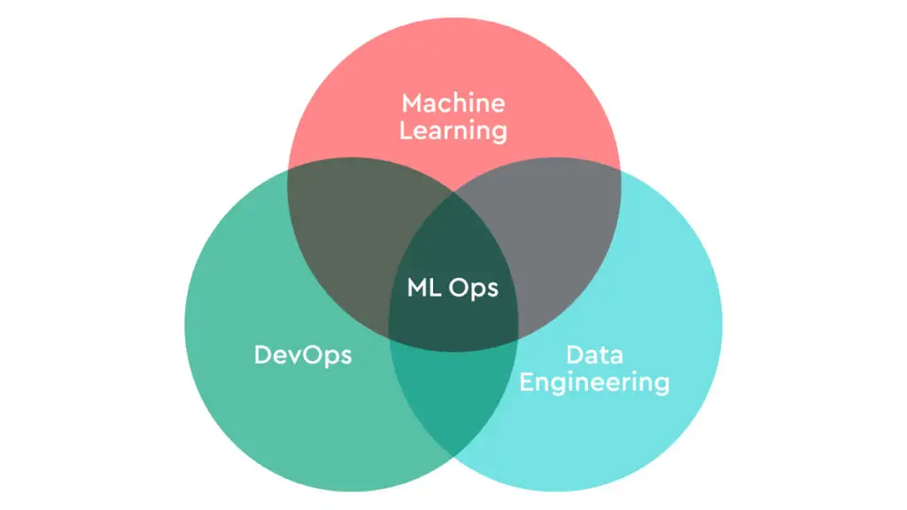
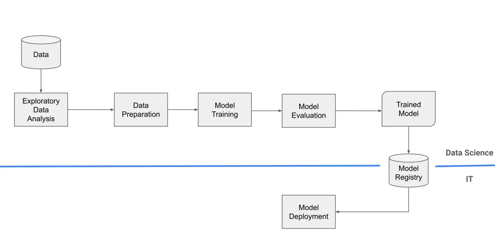
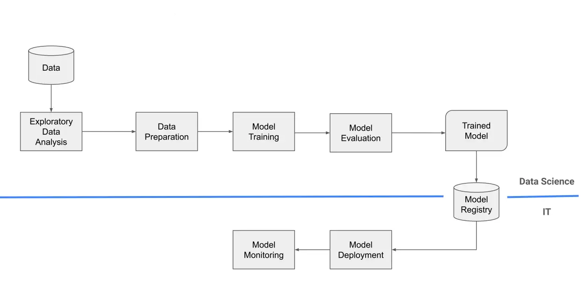
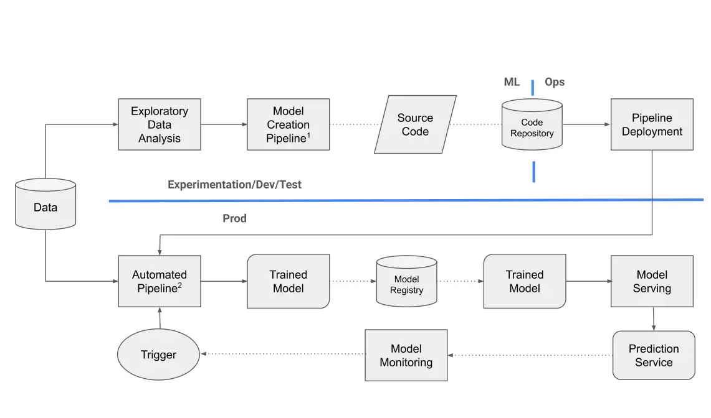

# Introduction to MLOps

MLOps, or Machine Learning Operations, extends the principles of DevOps to address the unique workflows and challenges associated with machine learning (ML). Like DevOps, MLOps focuses on improving collaboration between development and operations teams, but it is specifically tailored to managing the complexities of integrating ML models into production environments.

---

## What is MLOps?

MLOps is a set of practices that unifies machine learning (ML) model development and operations (Ops) with the aim of automating and streamlining the entire lifecycle of ML models. This includes stages such as data collection, model training, deployment, and continuous monitoring in production.

Building on the core principles of DevOps, MLOps addresses the specific challenges of machine learning by integrating automation, collaboration, and continuous feedback loops. It ensures that ML systems are developed, deployed, and maintained efficiently, with a focus on enabling the continuous delivery and improvement of machine learning models. By doing so, MLOps helps ensure that models remain effective, scalable, and adaptable to changing conditions in production environments.

### Definitions

- **MLOps** stands for machine learning operations and refers to the process of managing the machine learning lifecycle, from development to deployment and monitoring. It involves tasks such as: experiment tracking, model deployment, model monitoring, model retraining. (*Google Cloud*)
  
- **MLOps** is an ML culture and practice that unifies ML application development (Dev) with ML system deployment and operations (Ops). (*AWS*)
  
- **MLOps** is a practice that streamlines the development and deployment of ML models and AI workflows. (*Microsoft*)

---

## Why is MLOps required?

- **Complex lifecycle management**: The machine learning lifecycle involves many complex steps (data acquisition, preparation, training, monitoring, etc.), and collaboration between teams is crucial.

- **Data and model versioning**: MLOps ensures that changes in data and models are tracked and managed in an orderly manner.

- **Data Drift**: Models can become less effective due to changing data over time, a problem that MLOps helps to monitor and correct.

- **Integration with CI/CD**: Models are treated as integrated assets in CI/CD pipelines, ensuring a smoother release.

- **Continuous experimentation**: MLOps supports rapid and iterative experimentation cycles, reducing model implementation time.

---

## Principles of MLOps

This section covers the key concepts and core values of MLOps that must be followed to achieve a successful implementation.

### 1. Automation

Automate as much as possible to reduce human intervention and speed up the development and deployment processes.
This includes stages from data ingestion, preprocessing, model training, and validation to deployment.

These are some factors that can trigger automated model training and deployment:
 
- **Messaging**: Automation can be triggered by messages or notifications from monitoring or orchestration systems. For example, when a drop in model performance is detected, a message can trigger a new training phase to improve the model.
Example: A data drift warning that triggers the training of a new model based on updated data.

- **Monitoring or Calendar Events**:
Training and deployment pipelines can be scheduled to automatically perform checks or updates at set time intervals or in response to monitoring events. This allows models to be kept up-to-date and performing at all times.
Example: A scheduled trigger that performs a weekly or monthly retraining of the model, or monitoring that detects an increase in predictive anomalies.

- **Data Changes**:
Changes in data, such as the arrival of a new dataset or updated data sources, can automatically trigger model retraining. Automation can detect these changes and launch the pipeline without the need for manual intervention.
Example: New customer data triggering a model training iteration to update purchase behaviour predictions.

- **Model Training Code Changes**:
Changes to the code that handles model training, such as updating hyperparameters or changing the model architecture, can trigger a new training phase to validate and optimise the new model.
Example: An update in the code implementing a new neural network architecture, which requires a new training and testing phase of the model.

- **Application Code Changes**:
Changes in application code that consume the models, such as the addition of new features or changes in APIs, may require a model update to ensure compatibility. This may automatically initiate re-training or deployment of the model.
Example: An e-commerce application updates its recommendation engine and requires re-training of the prediction models based on user behaviour.

### 2. Continuous Integration (CI)
Continuous integration (CI), in the context of MLOps, extends the traditional concept of DevOps significantly. It is no longer limited to the integration of tests and software components, but also includes the validation and testing of data and models within the machine learning pipeline. This implies that, in addition to ensuring the correctness of the application code, the processes for verifying the quality of the data and models are also automated.

In this way, the CI in MLOps ensures that every part of the pipeline, whether code, data or models, undergoes rigorous and continuous testing, ensuring that any changes do not compromise the reliability of the entire system in production.

### 3. Continuous Delivery (CD)
Continuous Delivery (CD) is no longer limited to the deployment of a single package or service; it extends to the entire training pipeline. This approach automates the release of the new trained model or associated prediction service, ensuring that changes are ready to be implemented in production quickly and safely.

In this context, Continuous Delivery ensures that each update, be it a new model, a change in data or an improvement in business logic, can be seamlessly integrated and deployed, improving the flexibility and responsiveness of the entire system

### 4. Continuous Monitoring (CM)
Continuous Monitoring ensures that machine learning models are constantly monitored in production to detect problems such as data drift, performance degradation or other anomalies. This process involves monitoring both data and models, using metrics that reflect business objectives.

- Data monitoring focuses on observing changes in incoming data, ensuring that they remain consistent with the data used to train the model. Significant changes may indicate problems with data drift, i.e. when the statistical properties of the data change over time, making the model less effective.

- Model monitoring, on the other hand, concerns measuring model performance over time, using metrics such as accuracy, precision or other relevant business metrics. If performance falls below a certain threshold, re-training or modification of the model may be required.

### 5. Continuous Training (CT)

Continuous Training automates the process of re-training machine learning models to ensure that they remain accurate and perform well over time. This approach maintains the quality of the models through a continuous cycle of monitoring, re-training and redistribution.

It not only involves the automation of re-training, but also the deployment of the new model or associated prediction service. Thus, whenever changes in the data or phenomena such as data drift are detected, the system can automatically re-train the model and distribute an updated version, ensuring that performance remains optimal.

### 6. Model Management and Version Management

Model management in MLOps involves overseeing the lifecycle of machine learning models, from development and experimentation to deployment and monitoring. To ensure that models are effective and adaptable in production environments, a robust process of version management is essential. Version management tracks all changes made to models, the data they were trained on, and the code used in training, enabling reproducibility and accountability.

Key aspects of model and version management include:

- Versioning of models: Every model version is tracked to ensure that the exact combination of data, model parameters, and code used for training can be reproduced.

- Model governance: Establishing processes for review, validation, and approval of models to check for fairness, bias, and ethical considerations before deployment.

- Auditability: Ensuring that all changes to models are documented and can be audited for compliance with business and regulatory requirements.

- Collaboration: Facilitating clear communication and alignment between data scientists, engineers, and stakeholders through well-documented version control processes.

- Reproducibility: Ensuring that previous results can be replicated with the same dataset, code, and model configuration to ensure reliability.

## Benefits of MLOps

MLOps offers a range of tangible benefits that enhance the efficiency, scalability, and reliability of machine learning (ML) projects. By adopting MLOps, organizations can streamline their workflows, reduce risks, and improve collaboration between teams. Below are some key benefits:

### 1. Improved Efficiency
MLOps automates many stages of the ML lifecycle, from data preprocessing to model deployment, significantly reducing the time required to develop and deploy models. By streamlining these processes, organizations can transition from model development to production faster, optimizing their time-to-market and reducing operational costs. This enhanced efficiency allows data scientists to focus on higher-value tasks, such as improving model performance and generating business insights.

### 2. Increased Scalability
With MLOps, organizations can scale their machine learning operations to handle larger datasets and more complex models. MLOps enables teams to manage thousands of models efficiently through integrated workflows like continuous integration and continuous deployment (CI/CD). This scalability is crucial for enterprises that need to apply machine learning across different domains or handle rapid data growth. The framework ensures that models can be trained, deployed, and maintained at scale without compromising quality or performance.

### 3. Improved Model Accuracy
Continuous monitoring of deployed models allows organizations to ensure their predictions remain accurate and relevant. By automatically detecting issues like data drift—when new data no longer aligns with the training data—MLOps helps maintain the performance of ML models over time. Automated retraining mechanisms further enhance model accuracy by updating models in response to new data or business requirements, keeping predictions aligned with evolving trends.

### 4. Enhanced Collaboration
MLOps fosters greater collaboration between data scientists, software engineers, and operations teams. By providing standardized processes and tools, MLOps ensures that these teams can work together effectively, reducing silos and misunderstandings. This improved collaboration leads to a more cohesive development process, where teams can align on goals, track experiments, and ensure smooth transitions from development to deployment.

### 5. Reduced Risk of Errors
By automating repetitive tasks and enforcing continuous monitoring, MLOps reduces the likelihood of human error throughout the ML lifecycle. Automated workflows ensure that models are thoroughly tested, validated, and deployed without manual intervention. This not only minimizes errors in production but also increases confidence in model reliability and performance, making it easier to meet regulatory and compliance standards.

### 6. Mitigation of Data Drift
One of the common challenges in machine learning is data drift, where the incoming data used for predictions starts to differ from the original training data, leading to a decline in model performance. MLOps provides continuous monitoring of data and models, identifying and correcting data drift early to ensure consistent model performance over time. Automated retraining processes help to counteract data drift, keeping models up-to-date and relevant.

### 7. Faster Time to Market
With MLOps, organizations can accelerate the journey from model development to deployment. By automating infrastructure provisioning, model training, and deployment pipelines, MLOps enables faster go-to-market times. This increased agility helps businesses respond more quickly to market changes and new opportunities, giving them a competitive edge.

### 8. Cost Reduction
The automation and optimization of the ML lifecycle reduce the need for manual intervention, thereby lowering operational costs. By streamlining processes such as model retraining, monitoring, and deployment, MLOps frees up resources that can be used elsewhere in the organization. The ability to efficiently manage infrastructure and model workflows through MLOps leads to long-term cost savings and improved resource allocation.

## Levels of MLOps implementation

There are three levels of MLOps implementation, depending on the maturity of automation within the organization.

### MLOps Level 0

- Every step is manual, including data preparation, ML training, and model validation. The transitions between each phase are handled manually, requiring interaction at every step.
- Data scientists typically deliver trained models as artifacts to the engineering team for deployment.
- There is a separation between the data scientists who create the model and the engineers who deploy it.
- Retraining of models is infrequent, often happening only a few times per year.
- There is no integration of CI/CD pipelines for ML models, and active performance monitoring is absent.

---

### MLOps Level 1

- At Level 1, **basic automation** is introduced. While the steps in the ML pipeline are still not fully automated, monitoring is implemented to track the performance of the deployed model.
- **Model monitoring** helps detect issues like data drift, performance degradation, or anomalies.
- There is some level of automation in terms of **continuous integration** for the software, but ML model training and deployment are still semi-manual.
- Models may be retrained more frequently compared to Level 0, but this is still done on a scheduled basis.

---

### MLOps Level 2

- Level 2 introduces the **automation of the ML pipeline**. Both **continuous monitoring (CM)** and **continuous training (CT)** are applied to ensure that the model is consistently retrained with new data.
- The pipeline is designed to automatically trigger when new data arrives or when certain thresholds (e.g., data drift) are met.
- Reusable and composable modular code components are created for ML pipelines, allowing for a more **scalable** and **consistent** pipeline structure.
- The same pipeline is implemented across development, pre-production, and production environments, ensuring consistency and reducing errors.

---

### MLOps Level 3

- Level 3 represents the **full integration** of the ML pipeline into the **CI/CD process**, extending the concepts of DevOps to include model testing, data validation, and retraining.
- **Continuous Integration (CI)**: This includes building, testing, and packaging not only the application code but also the ML models.
- **Continuous Delivery (CD)**: The deployment process is fully automated, from retraining the model to deploying it alongside the application code, ensuring the model is always up-to-date and optimally performing in production.
- This level allows for the most **robust**, **scalable**, and **adaptive** machine learning operations.

